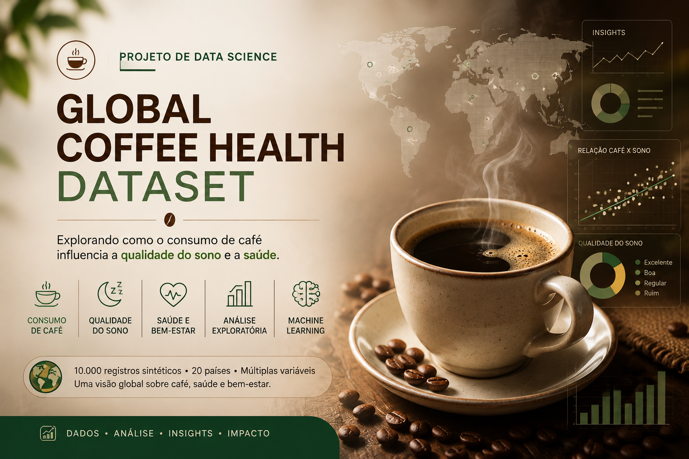

# ☕ Café, Estresse e Sono: Da Análise de Dados à Recomendação de Negócio

**Análise exploratória, geração de insights e modelagem preditiva sobre a relação entre consumo de café, estresse e qualidade do sono**

  

## 📌 Sobre o projeto

Este projeto simula uma demanda real de negócio: a empresa **H&LA** precisa entender como o consumo de café se relaciona com a qualidade do sono de seus clientes, a fim de orientar produtos, campanhas e conteúdos de saúde e bem-estar.

O trabalho percorre o ciclo completo de um projeto de Ciência de Dados — da limpeza e exploração dos dados até a modelagem preditiva — com foco constante em **transformar resultados estatísticos em decisões de negócio acionáveis**.

## ❓ Pergunta de negócio

> Como o consumo de café, o estresse e outros hábitos de vida se relacionam com a qualidade do sono dos clientes — e como a empresa pode usar isso para orientar melhor seus usuários?

## 🗃️ Sobre os dados

Dataset: [**Global Coffee Health Dataset**](https://www.kaggle.com/datasets/uom190346a/global-coffee-health-dataset) (Kaggle) — 10.000 registros sintéticos de participantes em 20 países.

| Categoria | Variáveis |
|---|---|
| Demográficas | Idade, Gênero, País |
| Consumo | Xícaras de café/dia, Cafeína (mg/dia), Tabagismo, Álcool |
| Sono | Horas de sono, Qualidade do sono |
| Saúde | IMC, Frequência cardíaca, Nível de estresse, Atividade física, Condições de saúde |
| Ocupacional | Ocupação principal |

## 🧭 Metodologia

O notebook está estruturado em três partes, seguindo o fluxo padrão de um projeto de dados aplicado:

| Etapa | O que foi feito |
|---|---|
| **1. Análise Exploratória (EDA)** | Verificação de dimensões, tipos, dados ausentes e duplicados · estatísticas descritivas · distribuições e outliers (skewness, boxplots) · matriz de correlação |
| **2. Visualização & Insights** | Gráficos comparativos (heatmaps, boxplots, linhas) · segmentações por gênero e faixa etária · formulação de insights de negócio |
| **3. Modelagem Preditiva** | Engenharia de features · pipeline de pré-processamento (evitando vazamento de dados) · treino e comparação de 3 modelos de classificação · avaliação e discussão crítica dos resultados |

## 🔎 Principais insights

| Achado | Evidência |
|---|---|
| Estresse é o maior "vilão" do sono — mais que o café | Correlação estresse × qualidade do sono: **r ≈ -0,91** vs. café × sono: **r ≈ -0,19** |
| Alto consumo de cafeína reduz o sono | Clientes com ≥ 400 mg/dia dormem **0,63h a menos** que clientes com < 200 mg/dia |
| Estresse alto = menos horas de sono | Baixo: **7,25h** · Médio: **5,58h** · Alto: **4,45h** por noite |
| Estresse impulsiona o consumo de café | Consumo médio de café cresce com o nível de estresse, principalmente entre 18–69 anos |
| Gênero não é um fator relevante | Padrões de sono e estresse muito semelhantes entre Male, Female e Other |
| Café não afeta IMC nem atividade física | Tendências lineares praticamente nulas entre essas variáveis |

## 🤖 Modelagem preditiva

**Alvo:** `Sleep_Quality` (Poor · Fair · Good · Excellent) — classificação multiclasse.

| Modelo | F1-macro (Validação Cruzada) | F1-macro (Teste) | Observação |
|---|:---:|:---:|---|
| **Regressão Logística** ⭐ | 0,9923 | ~0,99 | Melhor equilíbrio viés-variância, sem sinais de overfitting |
| LightGBM | 1,0000 | ~0,99 (0,96 na classe Excellent) | Indícios de overfitting |
| XGBoost | 1,0000 | ~0,99 (0,96 na classe Excellent) | Indícios de overfitting |

✅ **Modelo escolhido:** Regressão Logística, por generalizar melhor para dados não vistos.

O pré-processamento (`OneHotEncoder` + `StandardScaler`) foi encapsulado em um `Pipeline`/`ColumnTransformer`, ajustado somente sobre os dados de treino em cada fold da validação cruzada estratificada (`StratifiedKFold`) — prática que evita vazamento de informação entre treino e teste.

## 🔍 Interpretabilidade do Modelo

Além de avaliar o desempenho preditivo, buscamos entender *como* o modelo toma suas decisões. Para isso, aplicamos duas abordagens complementares sobre a Regressão Logística: análise dos coeficientes por classe e valores SHAP (SHapley Additive exPlanations).

| Variável | Impacto no modelo (SHAP) |
|---|:---:|
| `Sleep_Hours` | **64,82%** |
| Nível de Estresse | ~30,3% |
| `Coffee_Intake` | 0,50% |
| Demais variáveis (idade, IMC, atividade física, álcool, tabagismo) | contribuição residual |

`Sleep_Hours` concentra sozinha quase dois terços do impacto total nas previsões — resultado consistente com os coeficientes do modelo, que também destacam essa variável como a de maior peso entre as classes de qualidade do sono. O nível de estresse aparece como segundo fator mais relevante, enquanto o consumo de café apresenta contribuição residual dentro da estrutura deste modelo.

**Implicação para o negócio:** os resultados reforçam que orientações a clientes devem priorizar sono adequado e gerenciamento de estresse, e não apenas a redução do consumo de café — sem, no entanto, estabelecer causalidade, já que o modelo reflete comportamento preditivo, não relações causais.

> 💡 A forte concentração de impacto em `Sleep_Hours` (64,82%) é também um indício relevante ao avaliar a robustez do modelo: o comportamento preditivo depende fortemente de uma única variável altamente correlacionada com o próprio alvo — um ponto que reforça a importância de investigar possíveis vieses estruturais nos dados.

## 💼 Recomendações para o negócio  1

| Ação | Baseada em |
|---|---|
| **Alertas de consumo de cafeína** para clientes acima de 400 mg/dia, sugerindo redução gradual | Relação cafeína × horas de sono |
| **Priorizar programas de gestão de estresse** (mindfulness, atividade física, terapia digital) na proposta de valor | Estresse é o fator mais associado ao sono |
| **Conteúdo educativo sobre o ciclo estresse → café → sono ruim**, ajudando o cliente a quebrar o padrão | Associação entre estresse e maior consumo de café |
| **Segmentação de campanhas por faixa etária** (foco em 18–69 anos) | Efeito mais evidente nessa faixa etária |
| **Score preditivo de risco de sono ruim** integrado a painel/app, para ação preventiva | Modelo de Regressão Logística |
| **Comunicação transparente** sobre correlação vs. causalidade, reforçando busca por acompanhamento profissional | Limitações estatísticas e de dataset |

## 💼 Recomendações para o negócio  2

| Ação | Baseada em |
|---|---|
| **Priorizar programas de gestão de estresse** (mindfulness, atividade física, terapia digital) na proposta de valor | Estresse é o fator mais associado ao sono na EDA **e o 2º maior fator no modelo (~30,3% do impacto SHAP)** |
| **Conteúdo educativo sobre o ciclo estresse → café → sono ruim**, ajudando o cliente a quebrar o padrão | Associação entre estresse e maior consumo de café |
| **Alertas de consumo de cafeína** para clientes acima de 400 mg/dia, como ação complementar (não prioritária) | Relação cafeína × horas de sono na EDA — *nota: a interpretabilidade do modelo (Seção 4) sugere que esse efeito é, em parte, mediado pelo estresse, já que `Coffee_Intake` tem contribuição residual (0,50%) uma vez controladas as demais variáveis* |
| **Segmentação de campanhas por faixa etária** (foco em 18–69 anos) | Efeito mais evidente nessa faixa etária |
| **Score preditivo de risco de sono ruim**, com ressalva de dependência de `Sleep_Hours` | Modelo de Regressão Logística — *recomenda-se reavaliar a viabilidade em produção diante da possível dependência estrutural dessa variável (Seção de Limitações)* |
| **Comunicação transparente** sobre correlação vs. causalidade, reforçando busca por acompanhamento profissional | Limitações estatísticas e de dataset |

## 🧠 Skills demonstradas

`Análise Exploratória de Dados (EDA)` `Estatística Descritiva` `Visualização de Dados` `Engenharia de Features` `Machine Learning (Classificação)` `Validação Cruzada` `Pipelines com Scikit-learn` `Diagnóstico de Data Leakage` `Interpretabilidade de Modelos (SHAP)` `Storytelling com Dados` `Tradução de Resultados Técnicos em Recomendações de Negócio`

## 🛠️ Tecnologias utilizadas

- **Python 3**
- **Pandas** / **NumPy** — manipulação e análise de dados
- **Matplotlib** / **Seaborn** — visualização de dados
- **Scikit-learn** — pré-processamento, pipelines, validação cruzada, Regressão Logística
- **LightGBM** / **XGBoost** — modelos de gradient boosting
- **SHAP** — Interpretabilidade de modelos
- **Pickle** — serialização do modelo final

 

> [Veja o notebook para detalhes da análise.](https://github.com/Gleynner/coffee-sleep-health-analysis/blob/main/coffee_sleep_health_analysis.ipynb)

